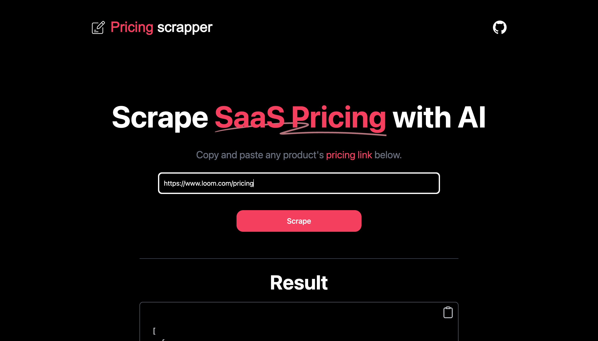

# [Pricing Page Scraper](https://pricing-scraper.vercel.app/)

This project scrapes pricing pages of SaaS products for you using AI.

[](https://pricing-scraper.vercel.app)

## How it works

This project uses the [OpenAI GPT-3.5 API](https://openai.com/api/) (specifically more efficient and cheaper model `gpt-3.5-turbo`) and [Vercel Edge functions](https://vercel.com/features/edge-functions) with streaming. It fetches the pricing page content, sends it in a prompt to the GPT-3.5 API to scrape it via a Vercel Edge function, then streams the response back to the application.

## TODO

[ ] - Add Rate limiting

[ ] - Add API support

[ ] - Ability to have interactive with frequency and currency toggles.

## Running Locally

After cloning the repo, go to [OpenAI](https://beta.openai.com/account/api-keys) to make an account and put your API key in a file called `.env`.

Then, run the application in the command line and it will be available at `http://localhost:3000`.

```bash
npm run dev
```

## One-Click Deploy

Deploy the example using [Vercel](https://vercel.com?utm_source=github&utm_medium=readme&utm_campaign=vercel-examples):

[](https://vercel.com/new/clone?repository-url=https://github.com/bharathvaj-ganesan/pricing-page-scraper&project-name=pricing-page-scraper&repo-name=pricing-page-scraper)
