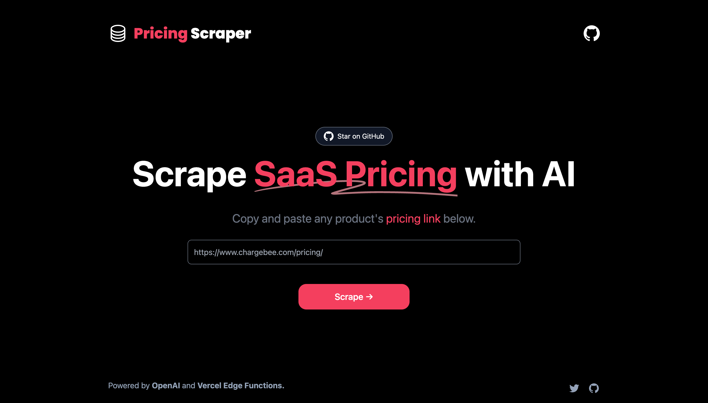

# [Pricing Page Scraper](https://pricing-scraper.vercel.app/)

This project scrapes pricing pages of SaaS products for you using AI.

[](https://pricing-scraper.vercel.app)

## How it works

This project uses the [OpenAI GPT-3.5 API](https://openai.com/api/) (specifically more efficient and cheaper model `gpt-3.5-turbo`) and [Vercel Edge functions](https://vercel.com/features/edge-functions) with streaming. It fetches the pricing page content, sends it in a prompt to the GPT-3.5 API to scrape it via a Vercel Edge function, then streams the response back to the application.


## Example Result
```
[
  {
    "plan_name": "FREE",
    "plan_amount": 0,
    "currency_code": "USD",
    "frequency": "monthly",
    "features": [
      "2,000 WORDS PER MONTH",
      "NO CREDIT CARD REQUIRED",
      "Only 1 user seat",
      "Chat by Copy.ai",
      "90+ copywriting tools",
      "Unlimited projects",
      "Blog Wizard tool",
      "25+ languages",
      "Access to newest features"
    ]
  },
  {
    "plan_name": "PRO",
    "plan_amount": 49,
    "currency_code": "USD",
    "frequency": "monthly",
    "features": [
      "UNLIMITED WORDS",
      "5 user seats",
      "Chat by Copy.ai",
      "90+ copywriting tools",
      "Unlimited projects",
      "Priority email support",
      "25+ languages",
      "Blog Wizard tool",
      "Access to newest features"
    ]
  },
  {
    "plan_name": "ENTERPRISE",
    "plan_amount": null,
    "currency_code": null,
    "frequency": null,
    "features": [
      "Automate Any Workflow",
      "API access",
      "Chat interface",
      "Prebuilt workflows library",
      "Private company Infobase"
    ]
  }
 }
```

## TODO

[ ] - Add Rate limiting

[ ] - Add API support

[ ] - Ability to have interaction with frequency and currency toggles and scrape.

## Running Locally

After cloning the repo, run the application in the command line and it will be available at `http://localhost:3000`.

```bash
npm run dev
```


## One-Click Deploy

Deploy the example using [Vercel](https://vercel.com?utm_source=github&utm_medium=readme&utm_campaign=vercel-examples):

[](https://vercel.com/new/clone?repository-url=https://github.com/bharathvaj-ganesan/pricing-page-scraper&project-name=pricing-page-scraper&repo-name=pricing-page-scraper)
